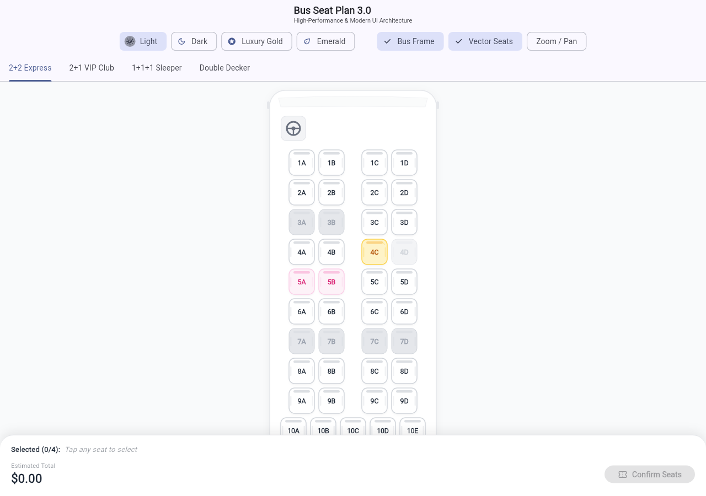

# Bus Seat Plan (v3.0)

A high-performance, modern, and highly customizable Flutter package for rendering interactive bus seat plans, sleeper layouts, multi-deck coaches, and seat selection workflows.

[](https://pub.dev/packages/bus_seat_plan)
[](LICENSE)

<div align="center">
  
</div>

---

## ✨ Features

- **🚀 Simple & Intuitive API**: Minimal usage needs only `seatLayout` and `onSeatTap`.
- **🎨 Premium UI & Vector Graphics**: Ergonomic automotive seats with headrests, side bolsters, lie-flat sleeper berths, steering wheel, and aerodynamic bus chassis frames.
- **⚡ High Performance**: Vector `CustomPainter` rendering with `RepaintBoundary` and reactive `SeatPlanController` for buttery smooth 60/120 FPS scrolling and selection.
- **🚌 Flexible Layouts**: 2+2 standard coaches, 2+1 VIP executive recliners, 1+1+1 sleeper buses, and multi-deck/double-decker layouts.
- **🛡️ Rich Seat Statuses & Types**:
  - **Statuses**: `available`, `selected`, `booked`, `reserved`, `disabled`, `femaleOnly`.
  - **Types**: `standard`, `semiSleeper`, `sleeper`, `vip`.
- **🎭 Theme Presets**: Built-in `light`, `dark`, `luxury`, `emerald` themes with complete customization.
- **🎛️ Reactive Controller**: Programmatic selection, max selection limits (`maxSelectedSeats`), total price calculation, and real-time status overrides.
- **🔍 Interactive Navigation**: Supports pinch-to-zoom and pan via `enableInteractiveViewer`.

---

## 📦 Installation

Add this to your `pubspec.yaml`:

```yaml
dependencies:
  bus_seat_plan: ^3.0.0
```

Then run:
```bash
flutter pub get
```

---

## 🚀 Quick Start (Minimal Usage)

```dart
import 'package:flutter/material.dart';
import 'package:bus_seat_plan/bus_seat_plan.dart';

class SimpleSeatPlanPage extends StatelessWidget {
  const SimpleSeatPlanPage({super.key});

  @override
  Widget build(BuildContext context) {
    // 1. Define layout from simple ASCII strings:
    // 's' = available, 'b' = booked, 'r' = reserved, '_' = aisle
    final layout = SeatLayout.fromStrings([
      'ss_ss',
      'ss_ss',
      'bx_ss',
      'ss_rd',
      'sssss',
    ]);

    return Scaffold(
      appBar: AppBar(title: const Text('Select Seat')),
      body: BusSeatPlan(
        seatLayout: layout,
        onSeatTap: (seat) {
          ScaffoldMessenger.of(context).showSnackBar(
            SnackBar(content: Text('Tapped ${seat.label}')),
          );
        },
      ),
    );
  }
}
```

---

## 🌟 Advanced Usage

### 1. Using `SeatPlanController` & Themes

```dart
final controller = SeatPlanController(
  maxSelectedSeats: 4,
  onMaxSeatsReached: () => print('Max 4 seats allowed!'),
  onSelectionChanged: (selectedSeats) {
    print('Selected: ${selectedSeats.map((s) => s.label).toList()}');
  },
);

BusSeatPlan(
  seatLayout: layout,
  controller: controller,
  theme: BusSeatThemeData.luxury(), // or .light(), .dark(), .emerald()
  enableInteractiveViewer: true, // Pinch-to-zoom
  onSeatTap: (seat) => print('Selected ${seat.label}'),
)
```

### 2. Multi-Deck / Double Decker Bus

```dart
final layout = SeatLayout.multiDeckFromStrings(
  lowerDeckMap: [
    'ss_ss',
    'ss_ss',
    'bx_ss',
    'sssss',
  ],
  upperDeckMap: [
    'l_l_l',
    'l_l_l',
    'b_l_l',
    'l_l_l',
  ],
  lowerDeckName: 'Lower Deck (Standard)',
  upperDeckName: 'Upper Deck (Sleeper Berth)',
);

BusSeatPlan(
  seatLayout: layout,
);
```

### 3. Layout String Symbols Reference

| Symbol | Meaning | Default Status | Default Type |
|---|---|---|---|
| `s`, `1`, `a` | Standard seat | `SeatStatus.available` | `SeatType.standard` |
| `v` | VIP Executive seat | `SeatStatus.available` | `SeatType.vip` |
| `l` | Sleeper berth (Lower) | `SeatStatus.available` | `SeatType.sleeper` |
| `u` | Sleeper berth (Upper) | `SeatStatus.available` | `SeatType.sleeper` |
| `m` | Semi-sleeper recliner | `SeatStatus.available` | `SeatType.semiSleeper` |
| `b`, `x` | Booked / Sold | `SeatStatus.booked` | `SeatType.standard` |
| `r` | Reserved / Held | `SeatStatus.reserved` | `SeatType.standard` |
| `d` | Disabled / Blocked | `SeatStatus.disabled` | `SeatType.standard` |
| `f` | Female-only seat | `SeatStatus.femaleOnly` | `SeatType.standard` |
| `_`, `-`, ` ` | Aisle / Space | `null` | - |

---

## 🎨 Theme Customization

```dart
final customTheme = BusSeatThemeData.light().copyWith(
  busBodyColor: Colors.white,
  busBorderColor: const Color(0xFFE2E8F0),
  showBusFrame: true,
  availableStyle: const SeatStyle(
    backgroundColor: Colors.white,
    foregroundColor: Color(0xFF0F172A),
    borderColor: Color(0xFFCBD5E1),
    borderWidth: 1.5,
  ),
  selectedStyle: const SeatStyle(
    backgroundColor: Color(0xFF2563EB),
    foregroundColor: Colors.white,
    borderColor: Color(0xFF1D4ED8),
  ),
);
```

---

## 📱 Interactive Playground Example App

Check out the `example/` directory for a full interactive visual playground demonstrating:
- Standard 2+2 Express, VIP 2+1 Club, Sleeper 1+1+1, and Double Decker layouts
- Real-time theme toggles (Light, Dark, Luxury Gold, Emerald)
- Dynamic pricing and live checkout summary bar
- Interactive zoom & pan controls

To run the example app:
```bash
cd example
flutter run
```

---

## 📄 License

This project is licensed under the MIT License - see the [LICENSE](LICENSE) file for details.
